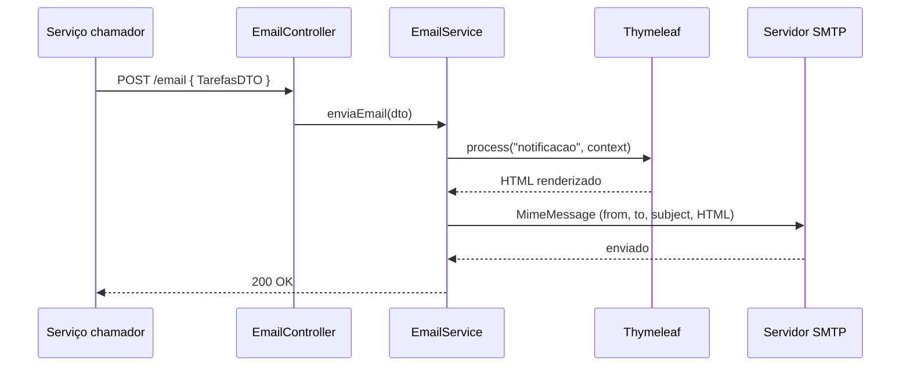

# Notificação — Serviço de Envio de E-mails

Microsserviço REST responsável por **enviar e-mails de notificação de tarefas** no sistema *Agendador de Tarefas*. Construído com **Java 17**, **Spring Boot 4**, **Spring Mail** e **Thymeleaf**.

É um serviço *stateless* e sem banco de dados: recebe os dados de uma tarefa, renderiza um template HTML e dispara o e-mail via SMTP.

---

## Stack

| Camada | Tecnologia |
|---|---|
| Linguagem | Java 17 |
| Framework | Spring Boot 4.1.0 (Web MVC) |
| Envio de e-mail | Spring Boot Starter Mail (JavaMailSender / SMTP) |
| Template de e-mail | Thymeleaf |
| Boilerplate | Lombok |
| Build | Gradle (wrapper incluso) |
| CI | GitHub Actions (build + testes em cada PR) |

---

## Arquitetura

```
com.javanauta.notificacao
├── NotificacaoApplication
├── controller/
│   └── EmailController          # POST /email
├── business/
│   ├── EmailService             # monta o MimeMessage, renderiza o template, envia
│   ├── dto/TarefasDTO
│   └── enums/StatusNotificacaoEnum
└── infrastructure/
    └── exceptions/EmailException

resources/
└── templates/notificacao.html   # template Thymeleaf do corpo do e-mail
```

### Como funciona



O `EmailService` usa `MimeMessageHelper` com suporte a multipart e charset UTF-8, injeta as variáveis `nomeTarefa`, `dataEvento` e `descricao` no `Context` do Thymeleaf, renderiza o template `notificacao.html` e envia o resultado como corpo HTML. O destinatário é o campo `emailUsuario` do DTO recebido.

Falhas de envio (`MessagingException`, `UnsupportedEncodingException`) são encapsuladas em uma `EmailException` própria.

---

## Endpoint

Base: `http://localhost:8082`

| Método | Rota | Descrição |
|---|---|---|
| `POST` | `/email` | Recebe um `TarefasDTO` e envia o e-mail de notificação para `emailUsuario`. |

### Exemplo

```bash
curl -X POST http://localhost:8082/email \
  -H "Content-Type: application/json" \
  -d '{
        "nomeTarefa": "Consulta odontológica",
        "descricao": "Retorno de avaliação",
        "dataEvento": "20-08-2026 14:30:00",
        "emailUsuario": "natan@email.com"
      }'
```

O e-mail resultante é o template `notificacao.html` preenchido: título, nome da tarefa em destaque, horário do evento e descrição.

---

## Como executar

### Pré-requisitos
- JDK 17+
- Uma conta SMTP (o `application.yaml` está configurado para Gmail; com 2FA ativo, é necessário gerar uma **senha de app**)

### Configuração

As credenciais **não estão versionadas** — preencha-as antes de subir o serviço, preferencialmente por variáveis de ambiente:

```yaml
spring:
  mail:
    host: smtp.gmail.com
    port: 587
    username: ${MAIL_USERNAME}
    password: ${MAIL_PASSWORD}

envio:
  email:
    remetente: ${MAIL_REMETENTE}
    nomeRemetente: 'Javanauta'

server:
  port: 8082
```

### Rodando

```bash
export MAIL_USERNAME="seu-email@gmail.com"
export MAIL_PASSWORD="sua-senha-de-app"
export MAIL_REMETENTE="seu-email@gmail.com"

./gradlew bootRun
```

A API sobe em `http://localhost:8082`.

---

## Ecossistema

Este serviço faz parte de um sistema em microsserviços:

| Serviço | Porta | Banco | Responsabilidade |
|---|---|---|---|
| [usuario](https://github.com/ntncsdata/usuario) | 8080 | PostgreSQL | Cadastro, autenticação, emissão do JWT |
| [agendadorTarefas](https://github.com/ntncsdata/agendadorTarefas) | 8081 | MongoDB | Agendamento e gestão de tarefas |
| **notificacao** (este) | 8082 | — | Envio de e-mails de notificação |

Fluxo pretendido: o serviço de tarefas identifica tarefas com `dataEvento` próxima e status `PENDENTE`, chama este serviço para notificar o usuário e então move a tarefa para `NOTIFICADO`.

---

## Roadmap

- [ ] **Integração com o serviço de tarefas**: hoje o `POST /email` não é chamado por ninguém. Falta o job agendado (`@Scheduled`) no serviço de tarefas e o cliente Feign apontando para cá.
- [ ] **Proteger o endpoint**: o `/email` está aberto e sem autenticação — qualquer requisição consegue disparar e-mails pelo remetente configurado.
- [ ] Bean Validation no `TarefasDTO` (`@Email` e `@NotBlank` em `emailUsuario`, `@NotBlank` em `nomeTarefa`).
- [ ] `@RestControllerAdvice` para tratar `EmailException` com resposta padronizada.
- [ ] Envio assíncrono (`@Async`) ou via fila (RabbitMQ/Kafka), evitando que o chamador fique bloqueado no SMTP.
- [ ] Retry com backoff em falhas transitórias de SMTP.
- [ ] Testes com GreenMail ou MailHog (SMTP fake) em vez de depender do Gmail.

---

## Autor

**Natan** — [@ntncsdata](https://github.com/ntncsdata)
